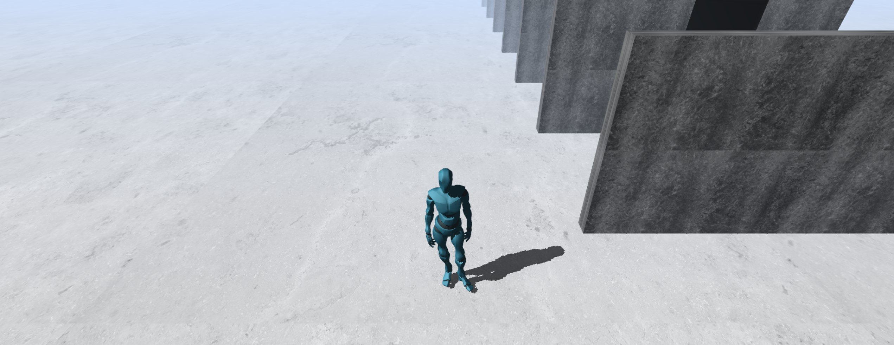

## Meta-universe created using Three Js & Vanilla Js

 - Humanoid model
 - 3d lighting effects and textures
 - Animation modules
 - Key Listeners
 - Box collision detection
 - Shaders

## Cloning the project
<pre>
git clone https://github.com/Jappan07/Metaverse-Game.git
cd Metaverse-Game
run live-server
</pre>

## Deployed here
<a href="https://jappan07.github.io/Metaverse-Game/" target="/blank">Link</a>

#